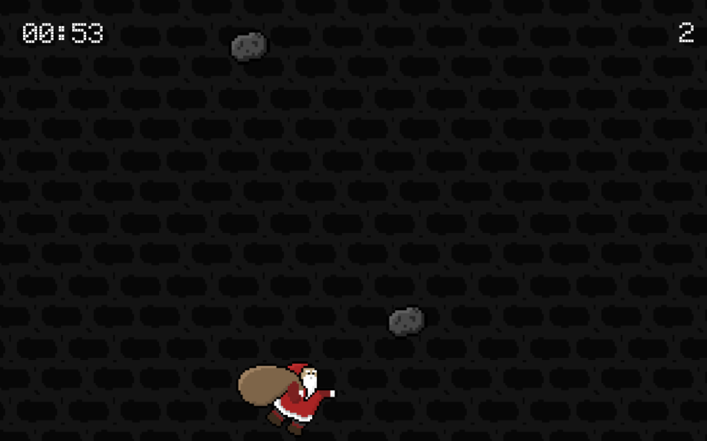
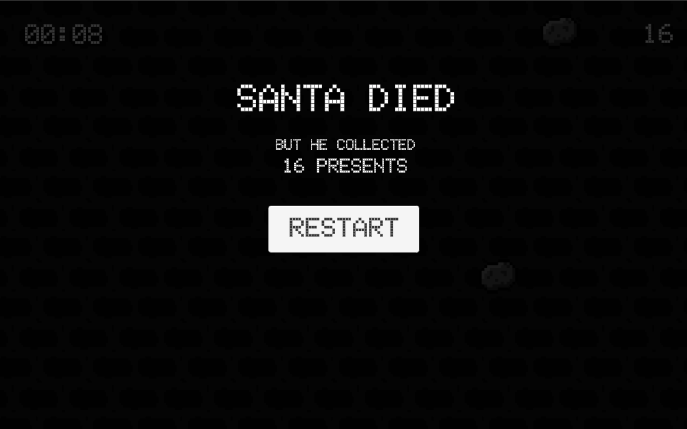
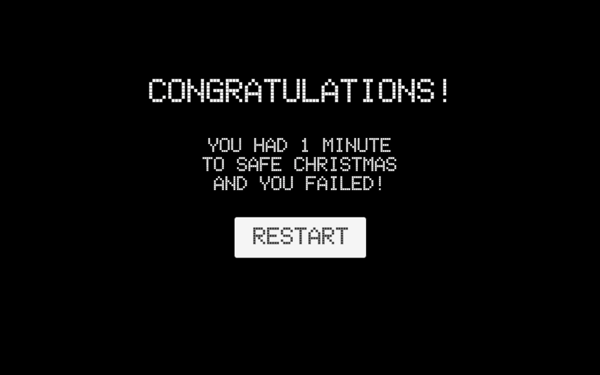

# weihnachtsspiel-NinjaSanta-rKremser

### Project description: 
The Ninja-Santa has to collect the presents and dodge the coalpieces to save christmas.

### Development platform: 
MacOS, Unity 2020.1.5f1, Visual Studio 2019, -

### Target platform: 
WebGL ref, res 960x600, screenindependent

- #### Necessary setup/execution steps:
  Add the Unity-Project, using UnityHub! Open the project!

### Visuals: 

### Third party material: 
-

### Project state: 
100% done

### Limitations: 
no graphics for Restart-Button

### Lessons Learned: 
using C#, using Unity's graphical interferface, if-statements, variables, basic 2D character-movement, object spawning & destroying

### Bulletpoints:
- 2D Project, screen-independent (960x600)
- Player movement Horizontal
- Timer 1 Minute (mechanic and display)
- Collectibles & Enemies spawning & movement
- Score mechanic: Collectibles, Player, Enemies Collisions & Trigger events
- Score display
- Every hit, the character moves 1 stage down
- He can get hit 3 times before going off screen
- When he's off screen, it's game over

Copyright by rKremser :)
